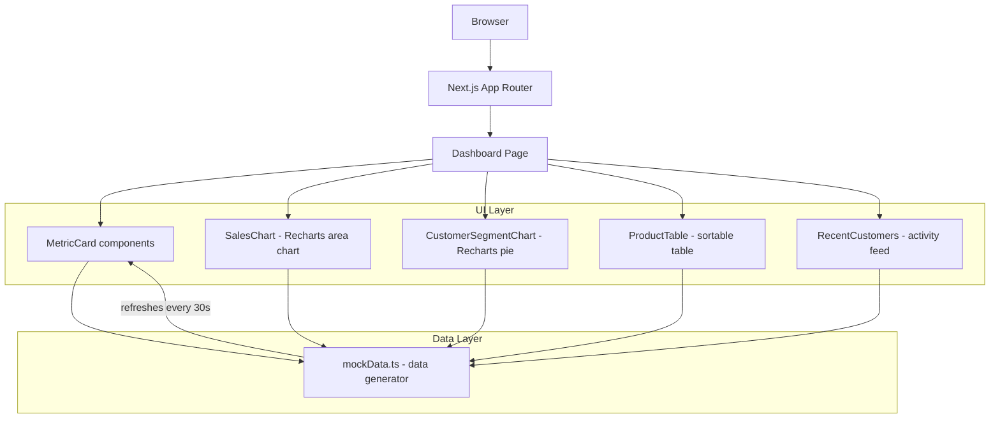

# E-Commerce Analytics Platform

Analytics dashboard for tracking sales, customers, and inventory. Built with Next.js 14, TypeScript, and Recharts. Data refreshes every 30 seconds to simulate real-time updates.

I wanted to build something that shows I can work with data visualization and typed frontend code, not just CRUD apps.

## architecture



## what it tracks

Sales: monthly revenue trends, order volume, conversion rates with percentage change indicators
Customers: segmentation by type (premium, regular, new), recent activity, purchase behavior
Inventory: top products by revenue, stock levels with status indicators, low stock alerts

## stack

Next.js 14, TypeScript, Tailwind CSS, Recharts, Framer Motion, Lucide React, date-fns

## structure

```
src/
  app/
    page.tsx              - main dashboard layout
    globals.css           - styles
    layout.tsx            - root layout
  components/
    MetricCard.tsx        - KPI cards with trend arrows
    SalesChart.tsx        - area chart for monthly sales
    CustomerSegmentChart.tsx - pie chart for segments
    ProductTable.tsx      - products with stock status
    RecentCustomers.tsx   - latest customer activity
  lib/
    mockData.ts           - generates realistic data
  types/
    analytics.ts          - TypeScript interfaces
```

## run it

```
npm install
npm run dev
```

Opens at localhost:3000. No API keys needed, runs on generated data.
